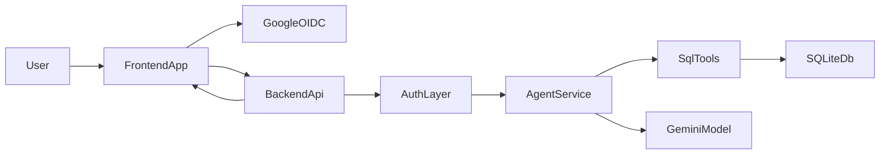
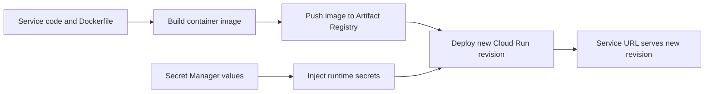

# GenAI Analytics Interview Project

This repository is an interview-ready GenAI analytics assistant designed for a senior consultant conversation. It demonstrates how a lightweight chat experience can turn a structured business dataset into a decision-support workflow: a user asks a natural-language question, an LLM-backed SQL agent reasons over the data, and the system streams both the final answer and the intermediate tool trace for transparency.

The current implementation is intentionally simple enough to explain end to end, but rich enough to discuss client value, architecture tradeoffs, responsible AI, and what it would take to evolve from a demo into an enterprise solution for a Germany / Berlin client context.

## Executive Summary

### Business Problem

Many analytics workflows still depend on analysts manually exploring dashboards, exporting spreadsheets, or writing ad hoc SQL for business stakeholders. That creates delays, bottlenecks, and inconsistent interpretation of metrics.

This project addresses that problem with a conversational analytics assistant that:

- lets users ask data questions in natural language
- translates the question into SQL through an agentic reasoning layer
- exposes the reasoning trace to build trust
- protects access through Google authentication plus backend authorization

### Value Proposition

From a customer value perspective, the solution is useful because it can:

- reduce time to insight for analysts and business users
- make structured data more accessible to non-technical stakeholders
- provide a reusable pattern for internal analytics copilots
- create a bridge between dashboard exploration and conversational decision support

For an interview discussion, the most important point is that this is not only a chatbot. It is a thin business workflow layer around structured data access, governed access control, and explainable GenAI-assisted reasoning.

## Why This Project Is Interview-Relevant

This project is framed to support a Germany / Berlin senior consultant discussion:

- it combines business relevance with practical implementation
- it shows how to move from proof of value to production thinking
- it surfaces tradeoffs rather than hiding them
- it opens conversations about GDPR, trustworthy AI, security, observability, and operating model design

The solution is especially relevant for clients that want a fast path to value from GenAI without starting with a large platform build. It is a strong demonstration of how a consulting team can use a lightweight prototype to validate user demand, identify data quality gaps, and define an enterprise roadmap.

## Current Product Scope

The current assistant supports:

- a Streamlit chat frontend with Google login
- a FastAPI backend with bearer-token verification
- a LangChain SQL agent powered by a Gemini model
- NDJSON streaming of tool calls, tool results, and final answers
- a SQLite-backed analytics dataset built from Excel source data
- Google Cloud deployment using Cloud Run, Artifact Registry, Secret Manager, and Terraform scaffolding

## End-To-End Flow



1. The user signs in through Google OIDC in the frontend.
2. The frontend obtains the Google ID token and sends it as a bearer token to the backend.
3. The backend verifies the token, checks the allowed email list, and initializes the SQL agent.
4. The agent inspects the schema, generates SQL, executes read-only database tools, and streams events back to the UI.
5. The frontend shows the final answer together with intermediate tool activity.

## CI/CD Deployment Flow (Frontend And Backend)

The current delivery flow is container-first:

- build image locally (or in CI)
- push to Artifact Registry
- update Cloud Run service to new image
- inject runtime secrets from Secret Manager
- route traffic to the new revision

### Generic Pipeline Flow



Notes:

- The same pipeline applies to both frontend and backend services.
- Backend secrets are injected mainly as environment variables.
- Frontend uses a hybrid pattern: environment variables plus mounted `.streamlit/secrets.toml`.

## Architecture Cheat Sheet

### Frontend

The frontend in [`frontend/`](./frontend) is a server-side Streamlit application.

It is responsible for:

- authentication UX
- session-only chat state
- rendering tool traces and final answers
- forwarding full conversation history to the backend on every turn

See [`frontend/README.md`](./frontend/README.md).

### Backend

The backend in [`backend/`](./backend) is a FastAPI service that exposes:

- `GET /health`
- `POST /chat/stream`

It is responsible for:

- configuration loading
- Google token verification
- allowlist-based authorization
- LangChain SQL agent execution
- NDJSON streaming

See [`backend/README.md`](./backend/README.md).

### Infrastructure

The infrastructure in [`infra/terraform/`](./infra/terraform) provisions:

- Artifact Registry
- Secret Manager placeholders
- Cloud Run services
- service accounts and IAM

The platform is intentionally lightweight and interview-friendly, while leaving room to discuss what should be automated or hardened next.

See [`infra/terraform/README.md`](./infra/terraform/README.md).

## Repository Structure

```text
sql_agent_interview/
  frontend/         # Streamlit chat UI
  backend/          # FastAPI API + LangChain agent runtime
  infra/terraform/  # Google Cloud infrastructure scaffolding
  data/             # source data assets and conversion utility
  langchain/        # notebooks / experimentation assets
```

## Technical Decisions And Why They Make Sense

### Why Streamlit

Streamlit keeps the interface simple and fast to demo. For an interview setting, that is valuable because it avoids overengineering the UI and keeps attention on user value, authentication, and the agent workflow.

### Why FastAPI

FastAPI provides a clean API layer for:

- health checks
- auth enforcement
- NDJSON streaming
- later evolution toward a more modular service architecture

### Why LangChain SQL Agent

The SQL agent pattern is a strong fit for structured analytics because it demonstrates:

- tool-using LLM behavior instead of pure text generation
- transparent intermediate reasoning through tool traces
- a path toward domain-specific agent orchestration

### Why SQLite For Now

SQLite is a pragmatic choice for a demo because it minimizes infrastructure overhead and shortens setup time. It is not the target end state for enterprise scale, but it supports a clear proof of value.

## Current State Vs Enterprise Evolution

### What Works Today

- secure sign-in through Google OIDC
- backend-side authorization by allowed email
- conversational SQL reasoning
- event streaming for transparency
- cloud hosting on Google Cloud Run

### What Is Intentionally Lightweight

- session-only frontend memory
- SQLite as the primary datastore
- manual deployment steps after infrastructure bootstrap
- no formal evaluation harness
- no persistent observability stack for prompts, traces, latency, or model quality

### What I Would Recommend Next

- move from SQLite to a managed database
- add CI/CD and environment promotion
- add remote Terraform state
- centralize runtime secret delivery fully in infrastructure code
- add LLM observability, tracing, and evaluation
- introduce domain-aware routing or multiple SQL agents by schema
- add a business glossary retrieval layer to improve metric interpretation

## Investigation Tracks For Interview Discussion

### Business And Operating Model

- Which business personas benefit most: analysts, leaders, sustainability teams, finance teams, or PMO teams?
- What measurable KPI should define success: time saved, adoption, self-service analytics rate, or decision cycle time?
- Should this evolve into an internal copilot, executive assistant, or domain-specific analytics product?

### GenAI And Agent Design

- one SQL agent per schema or business domain
- router agent for intent classification
- glossary retrieval for business terminology
- conversation summarization for longer sessions
- hybrid agent patterns that combine SQL, retrieval, and deterministic business rules

### Trustworthy AI

- prompt and tool observability
- audit trails for sensitive data access
- hallucination containment and SQL guardrails
- human oversight for high-impact decision support
- explainability and traceability in a Germany / EU enterprise setting

### Platform And Scale

- managed database migration
- monitoring and alerting
- load and concurrency design
- remote Terraform state and policy controls
- role-based access control and multi-tenant design

## Germany / EU Talking Points

For a Germany / Berlin interview, I would explicitly frame the solution around:

- privacy and data minimization
- secure access to enterprise data
- explainable and auditable GenAI behavior
- governance readiness aligned with GDPR and EU AI Act expectations
- practical rollout strategy instead of innovation theater

The consulting message is: start with a contained, explainable use case that proves value quickly, then add governance, platform controls, and operating model maturity as adoption grows.

## Demo Limitations To Acknowledge Transparently

- the frontend is not a full SPA and does not persist chat history
- the backend is stateless per request and relies on the client to resend conversation state
- the current deployment path still includes manual steps outside Terraform
- the data layer is simple and optimized for demo speed rather than enterprise data management

These are not weaknesses to hide. They are the basis for a mature discussion about sequencing, tradeoffs, and transformation planning.

## Interview Questions This README Helps Answer

- What business problem does this solve?
- Why is a conversational interface better than another dashboard?
- Why was this architecture chosen?
- What are the main risks and limitations?
- How would you harden this for enterprise use?
- How would you scale this responsibly in a German or EU client environment?

## Setup Pointers

- Backend setup and API details: [`backend/README.md`](./backend/README.md)
- Frontend setup and auth details: [`frontend/README.md`](./frontend/README.md)
- Infrastructure and deployment details: [`infra/terraform/README.md`](./infra/terraform/README.md)

## Notes

- Local secrets are intentionally excluded from git.
- This repository should be presented as a strong proof of value with a credible roadmap, not as a finished enterprise platform.
