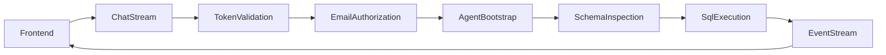

# Backend Agent Service

This backend is the decision engine of the project. It combines authentication, configuration management, SQL-agent orchestration, and NDJSON streaming in a single FastAPI service that is simple enough to explain in an interview and structured enough to discuss enterprise evolution.

## Backend Role In The Product

From a business perspective, the backend converts a natural-language analytics question into a governed data-access workflow:

- authenticate the caller
- authorize access to the application
- interpret the user question
- inspect database structure
- generate and execute SQL
- stream back both traceability signals and the final answer

That is valuable because it moves the LLM from pure text generation into a constrained, tool-using analytics workflow.

## Why This Design Matters

This service is intentionally designed as a thin but flexible processing layer:

- `FastAPI` provides a clean API surface and health endpoint
- `LangChain` provides agent and tool orchestration
- `SQLDatabaseToolkit` gives the model controlled access to the database
- `NDJSON` streaming makes the reasoning process inspectable in real time

For an interview discussion, the important design message is that the backend is not overengineered. It is a compact reference architecture that demonstrates how to separate:

- presentation
- auth and policy enforcement
- model/tool orchestration
- data access

## What The Service Does

- exposes `GET /health` for readiness and smoke tests
- exposes `POST /chat/stream` for authenticated chat requests
- accepts the full conversation thread on every request
- verifies Google bearer tokens against a configured OAuth client ID
- enforces a backend allowlist of user emails
- runs a read-only SQL agent over the configured database
- streams agent events as newline-delimited JSON

## Backend Flow



## Folder Layout

```text
backend/
  app/
    __init__.py
    main.py        # FastAPI app + startup validation
    api.py         # endpoints and dependency wiring
    agent.py       # LangChain SQL agent orchestration
    auth.py        # Google token verification + allowlist logic
    config.py      # env-driven runtime configuration
    schemas.py     # request/response models
    streaming.py   # NDJSON helpers
  .env.example
  Dockerfile
  requirements.txt
```

## Runtime Contract

### Request Model

The backend is intentionally stateless per request. The frontend sends the full conversation history with every chat call, which keeps the backend simple and horizontally scalable, but shifts conversation-state responsibility to the client.

### Response Model

The backend returns an NDJSON stream (`application/x-ndjson`) with event objects such as:

- `tool_call`
- `tool_result`
- `final`
- `error`

This creates a useful trust signal for users and interviewers because it shows how the assistant reasoned rather than only returning a final sentence.

## Key Technical Behaviors

### Startup Validation

On startup, the application initializes settings and the agent service early so configuration or data problems fail fast instead of surfacing only at first user request.

### Authentication And Authorization

The backend verifies Google ID tokens and then applies a separate allowlist-based authorization step. That distinction matters:

- authentication proves the user is who they claim to be
- authorization decides whether that user is allowed to use the service

This is an important interview talking point because it shows defense in depth rather than trusting frontend login alone.

### SQL Safety

The agent prompt explicitly instructs the model to:

- inspect tables first
- inspect relevant schema before querying
- avoid DML statements
- limit result size
- retry when SQL errors occur

This does not make the system production-safe on its own, but it is a good base for discussing guardrails and policy controls.

## Configuration Cheat Sheet

The service is configured through environment variables loaded by [`app/config.py`](./app/config.py).

Important values:

- `GOOGLE_API_KEY`
- `GOOGLE_OAUTH_CLIENT_ID`
- `ALLOWED_EMAILS`
- `MODEL_NAME`
- `DATABASE_URL`
- `APP_NAME`
- `LOG_LEVEL`

### Interview Talking Point

This configuration model is intentionally simple. It is enough for local development and cloud secret injection, while keeping a clean path toward stronger environment separation later.

## Local Setup

1. Create and activate a Python environment.
2. Install dependencies:

```bash
pip install -r requirements.txt
```

3. Create `.env` in `backend/` based on `.env.example`.
4. Make sure the configured database file exists.

## Local Run

From inside `backend/`:

```bash
uvicorn app.main:app --host 127.0.0.1 --port 8000 --reload
```

For container or Cloud Run style hosting, the service should bind to `0.0.0.0:$PORT`. That is already reflected in [`Dockerfile`](./Dockerfile).

## API Cheat Sheet

### Health

```bash
curl -s http://127.0.0.1:8000/health
```

Expected response:

```json
{"status":"ok","app":"target-dashboard-agent"}
```

### Stream Chat

```bash
export ID_TOKEN="your_google_id_token"

curl -N -X POST "http://127.0.0.1:8000/chat/stream" \
  -H "Content-Type: application/json" \
  -H "Authorization: Bearer ${ID_TOKEN}" \
  -d '{
    "messages": [
      {"role": "system", "content": "You are a data assistant."},
      {"role": "user", "content": "Which sectors have the highest number of companies with set targets?"}
    ]
  }'
```

## Current Tradeoffs

### Why They Make Sense For A Demo

- stateless backend reduces operational complexity
- SQLite minimizes infrastructure overhead
- prompt-based SQL safety is fast to explain and prototype
- NDJSON streaming increases transparency with minimal protocol overhead

### What They Limit

- no persistent conversation memory
- no advanced query policy enforcement
- no centralized LLM tracing or evaluation
- no managed database resilience or scale characteristics
- limited operational controls compared with a production analytics platform

## Germany / EU Governance Angle

This service is a useful anchor for a Germany / Berlin consulting conversation because it creates clear entry points for discussing:

- least-privilege data access
- auditable request flows
- explainability through tool traces
- privacy-aware architecture decisions
- human oversight and policy controls for GenAI-enabled analytics

It is also a good setup for discussing how a client would move from a prototype to a more compliant and governed implementation aligned with GDPR and broader EU AI governance expectations.

## GenAI Enhancement Roadmap

### High-Value Technical Enhancements

- multiple SQL agents by schema or business domain
- routing layer to direct questions to the right agent or toolset
- semantic retrieval over metric definitions and business glossary documents
- query validation or static SQL checks before execution
- cached schema summaries to reduce latency and cost
- conversation summarization for long user sessions

### Observability And Quality Enhancements

- LLM tracing with token, latency, and tool-level telemetry
- prompt and model version tracking
- golden-question evaluation set
- regression tests for SQL generation quality
- production dashboards for failures, latency, and refusal patterns

### Governance Enhancements

- stronger SQL allowlists and policy enforcement
- role-based data access
- audit logs for sensitive analytics access
- approval workflow for high-impact use cases
- explicit fallback behavior when confidence is low

## Interview Questions This README Helps Answer

- Why is the backend stateless?
- Why use an agent instead of direct templated SQL?
- How is access controlled?
- What are the main production risks?
- How would you productionize this responsibly?
- How would you scale from one schema to multiple domains?

## Related Files

- App bootstrap: [`app/main.py`](./app/main.py)
- Endpoint layer: [`app/api.py`](./app/api.py)
- Auth policy: [`app/auth.py`](./app/auth.py)
- Agent orchestration: [`app/agent.py`](./app/agent.py)
- Config contract: [`app/config.py`](./app/config.py)
