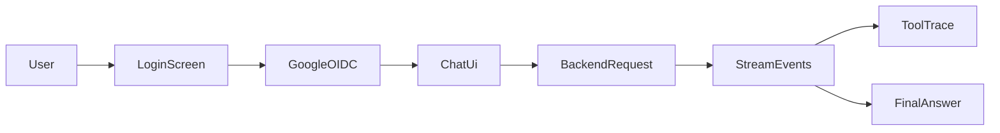

# Streamlit Frontend

This frontend is the user-facing layer of the project. It is intentionally lightweight, but it still demonstrates the most important user experience elements of a GenAI analytics assistant:

- authenticated access
- conversational interaction
- live transparency into agent behavior
- clear handoff between user-facing UX and backend-side policy enforcement

## Frontend Role In The Product

From a customer value perspective, the frontend does more than render chat bubbles. It is the trust surface of the solution.

It is responsible for:

- presenting a simple chat experience that non-technical users can understand quickly
- handling Google sign-in
- keeping the conversation visible and navigable
- surfacing intermediate tool activity to make the assistant feel less opaque
- passing the authenticated request to the backend for governed execution

For an interview discussion, this is important because a successful GenAI product depends on adoption, trust, and usability, not only on model quality.

## What The Frontend Does

- uses Streamlit as a server-side Python UI layer
- authenticates users through Google OIDC using `st.login`
- stores conversation state in `st.session_state`
- sends the Google ID token to the backend as a bearer token
- reads NDJSON stream events from the backend
- renders both the final answer and the tool trace

## User Journey



1. The user opens the app.
2. The app requires Google sign-in before showing the chat.
3. The frontend stores session state locally in Streamlit.
4. When the user asks a question, the frontend sends the full conversation plus the current ID token to the backend.
5. The UI streams intermediate tool activity and the final answer.

## Why This Design Works For A Demo

### Why Streamlit

Streamlit is a strong fit for this project because it keeps the user interface simple and fast to explain. In an interview context, that is useful because it keeps the focus on the business workflow and GenAI interaction model instead of frontend framework complexity.

### Why Session Memory

Session-only memory is a deliberate simplification:

- it reduces persistence complexity
- it makes the user flow easy to reason about
- it supports a clean demo of chat turns and backend calls

The tradeoff is that refreshing the page clears the chat history.

## Local Requirements

- Python 3.10+
- backend available locally or remotely
- Google OAuth client credentials
- Streamlit auth configuration in a local secrets file

## Local Install

From `frontend/`:

```bash
pip install -r requirements.txt
```

## Local Auth Configuration

Create `frontend/.streamlit/secrets.toml`:

```toml
[auth]
redirect_uri = "http://localhost:8501/oauth2callback"
cookie_secret = "your_random_cookie_secret"
client_id = "your_google_client_id"
client_secret = "your_google_client_secret"
server_metadata_url = "https://accounts.google.com/.well-known/openid-configuration"
expose_tokens = "id"
```

Important:

- keep this file local and out of git
- `redirect_uri` must exactly match the Google OAuth client configuration
- `expose_tokens = "id"` is required because the backend verifies the Google ID token

## Local Run

```bash
streamlit run app.py
```

## Backend URL Behavior

The frontend uses:

- `BACKEND_BASE_URL` environment variable, or
- a sidebar `Backend URL` input

Default fallback:

```text
http://127.0.0.1:8000
```

This is useful in an interview because it shows a simple but flexible boundary between UI and service layer.

## Cloud Deployment Notes

In cloud environments, the frontend needs two configuration paths:

- a backend base URL
- a valid Streamlit `secrets.toml` equivalent for auth

In the current Google Cloud deployment, the frontend is containerized and deployed on Cloud Run. The Streamlit auth configuration is supplied through Secret Manager and mounted into the container at runtime rather than baked into the image.

That is an important architectural talking point:

- local development uses a local secrets file
- cloud deployment should use secret injection, not embedded credentials

## Authentication And Authorization Cheat Sheet

### Authentication

The frontend uses Google OIDC to authenticate the user.

### Authorization

The frontend is not trusted as the final policy decision point. The backend still verifies the token and checks whether the user email is allowlisted.

This is a strong interview talking point because it demonstrates separation between UX authentication and backend enforcement.

## What Users See During A Query

The frontend renders:

- the user prompt
- a live status section while the agent works
- tool call and tool result events
- the final answer
- fallback error messages if the backend stream fails

This is a simple but valuable transparency pattern. It helps build trust by showing that the assistant is executing tools rather than fabricating answers with no evidence trail.

## Typical Local Workflow

1. Start the backend from [`../backend`](../backend).
2. Start the frontend:

```bash
streamlit run app.py
```

3. Log in with Google.
4. Ask a question.
5. Inspect the tool activity during and after the run.

## Current Tradeoffs

### Why They Make Sense

- minimal UI complexity keeps the demo focused
- session memory keeps implementation fast and understandable
- server-side Streamlit simplifies auth and backend integration
- direct backend streaming makes the system feel responsive and transparent

### What They Limit

- no persisted chat history
- no user feedback capture
- no analytics on adoption or user behavior
- no role-based UI behavior
- no long-running conversation management beyond session memory

## Business And Adoption Lens

For a Germany / Berlin conversation, the frontend should be framed as the adoption layer of the product.

The most relevant product questions are:

- does the interface help a business user trust the answer?
- is the workflow simple enough for non-technical adoption?
- can feedback be captured to improve model quality and change management?
- how would this fit into a broader internal analytics operating model?

## GenAI Enhancement Ideas

### Product Enhancements

- persistent conversation history
- saved prompts and suggested business questions
- user feedback buttons on every answer
- clarification prompts when intent is ambiguous
- result export for business workflows

### Intelligent UX Enhancements

- conversation summarization between sessions
- recommended follow-up questions
- role-aware dashboards or prompt templates
- glossary tooltips for business terminology

### Enterprise Adoption Enhancements

- usage analytics and telemetry
- feature flags for staged rollout
- multilingual support for broader user groups
- onboarding patterns and embedded help

## Germany / EU Trust Angle

This frontend is also a useful place to discuss:

- explicit user consent and transparency
- privacy-aware session design
- explainability through visible tool activity
- trust-building UI choices for regulated or risk-sensitive environments

## Interview Questions This README Helps Answer

- Why was Streamlit enough for this use case?
- How do login and authorization differ?
- How is backend trust enforced if the user is already signed in?
- Why expose tool traces to the user?
- What would you change first for enterprise adoption?

## Related Files

- Main UI logic: [`app.py`](./app.py)
- Backend client logic: [`api_client.py`](./api_client.py)
- Root project narrative: [`../README.md`](../README.md)
- Backend deep dive: [`../backend/README.md`](../backend/README.md)
