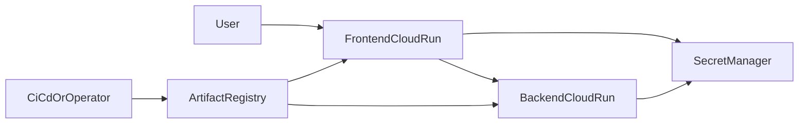

# Terraform Infrastructure (Google Cloud)

This folder contains the infrastructure cheat sheet for the project. It is intentionally scoped to a pragmatic interview deployment on Google Cloud, while leaving clear room to discuss what would change for a more mature enterprise platform.

## Infrastructure Purpose

From a business and delivery perspective, this Terraform layer demonstrates that the project is not only a notebook or local prototype. It shows how the solution can be hosted in a secure, cloud-native shape with:

- deployable services
- container image management
- secret storage
- service identities
- least-privilege style access between runtime and secrets

For an interview discussion, this matters because it demonstrates structured delivery thinking beyond model experimentation.

## What Terraform Provisions

The code in this folder provisions:

- Artifact Registry repository for container images
- Secret Manager secret placeholders for frontend and backend configuration
- service accounts for frontend runtime, backend runtime, and deployment automation
- IAM bindings for secret access and deployment permissions
- public Cloud Run services for frontend and backend
- outputs for URLs, service accounts, and secret IDs

## Platform Shape



## Why This Design Makes Sense

### Why Cloud Run

Cloud Run is a strong fit because it is the closest Google Cloud equivalent to Azure Container Apps for this use case:

- low operational overhead
- native container hosting
- easy secret integration
- simple HTTPS exposure
- good interview-time explainability

### Why Artifact Registry

Artifact Registry provides a clear separation between source code and deployable images. That is useful both operationally and from an architecture-storytelling perspective.

### Why Secret Manager

Secret Manager is the right place for runtime configuration because it keeps credentials out of the codebase and supports service-account based access, which is easy to relate to Azure managed identity.

## Current Inputs

- Project: `gzguevara`
- Region: `europe-west10` (Berlin)
- Terraform state: local
- Cloud Run exposure: public frontend and public backend

## What Is Managed In Terraform Vs What Is Manual

### Managed By Terraform

- Artifact Registry repository
- Cloud Run services
- Secret objects
- service accounts
- IAM bindings

### Currently Manual After Terraform

- adding secret values to Secret Manager
- building Docker images
- pushing images to Artifact Registry
- updating Cloud Run services to use the real images
- mounting or injecting the final runtime secrets
- updating OAuth redirect URIs in the Google OAuth client

This distinction is important. The infrastructure code establishes the platform shape, but the end-to-end application deployment still includes manual operational steps.

## Security Model

### Runtime Identity

The frontend and backend each receive their own service account.

### Secret Access

Secret Manager access is granted through IAM so each runtime can access only the secrets it needs.

### Public Exposure Tradeoff

Both Cloud Run services are publicly invokable today. That is acceptable for a demo because:

- the frontend is intended to be user-facing
- the backend still enforces application-level token verification and allowlist checks

For an interview, the right way to present this is:

- it is a pragmatic demo choice
- it keeps the architecture simple
- in a production environment, a stronger network posture would be considered

## Actual Deployment Reality

The repository now includes container build definitions in:

- [`../../backend/Dockerfile`](../../backend/Dockerfile)
- [`../../frontend/Dockerfile`](../../frontend/Dockerfile)

The deployment pattern used in practice is:

1. apply Terraform to provision infrastructure
2. add secret versions manually
3. build and push backend and frontend images
4. update Cloud Run services to use the real images
5. inject runtime secrets and mount the frontend Streamlit secrets file

That means the current Terraform code should be described as a strong infrastructure foundation, but not yet a full GitOps or CI/CD deployment pipeline.

## Prerequisites

1. Install Terraform `>= 1.6`.
2. Authenticate with Google Cloud:
   - `gcloud auth application-default login`
   - `gcloud config set project gzguevara`
3. Enable required APIs manually:
   - Cloud Run Admin API
   - Artifact Registry API
   - Secret Manager API
   - IAM API
   - Cloud Resource Manager API

## Terraform Usage

```bash
cd infra/terraform
terraform init
terraform plan
terraform apply
```

## Important Operational Notes

### Local State

Terraform state is local in this project. That is acceptable for an interview or solo prototype, but not ideal for team-scale delivery.

### Placeholder Images

Terraform creates Cloud Run services with placeholder image references. The real application deployment happens afterward through image build, push, and service update steps.

### Secret Placeholders

Terraform creates secret objects only. Values are added later through manual secret version creation.

### Frontend Secret Delivery

The frontend depends on a Streamlit auth secret file. In cloud deployment, that configuration is better mounted from Secret Manager than stored inside the container image.

## Current Tradeoffs

### Why They Make Sense

- local Terraform state keeps setup simple
- public Cloud Run endpoints reduce operational complexity for a demo
- manual post-Terraform deployment steps keep the infrastructure code smaller and easier to explain
- Secret Manager placeholders allow clean separation between infrastructure and sensitive values

### What They Limit

- no remote state locking or collaboration workflow
- no fully automated environment promotion
- drift risk between Terraform-defined infrastructure and manual runtime updates
- incomplete infrastructure-as-code coverage for final application configuration

## Germany / EU Platform Framing

For a Germany / Berlin conversation, the most relevant platform themes are:

- secure-by-default runtime design
- least-privilege access to secrets
- auditability of runtime configuration changes
- privacy-aware deployment patterns
- clear path toward compliance-oriented hardening

The infrastructure is therefore best described as a foundation that supports a trustworthy AI story, but still requires additional platform maturity for enterprise scale.

## Recommended Hardening Roadmap

### Near-Term Enhancements

- move manual Cloud Run updates into code or scripted deployment
- add remote Terraform state
- add CI/CD for image build and promotion
- codify secret mounting and runtime env mapping
- add `.dockerignore` and stronger build hygiene controls

### Platform Enhancements

- Cloud Run monitoring and alerting
- structured audit logs and release traceability
- custom domain and certificate management
- non-production and production environment separation
- managed database migration path

### Trustworthy AI Enhancements

- observability for model calls and tool usage
- evaluation and regression tracking
- policy controls for sensitive data access
- explicit human review patterns for higher-risk use cases

## Interview Questions This README Helps Answer

- What does Terraform provision today?
- What is still manual after infrastructure bootstrap?
- Why was Cloud Run chosen?
- How are secrets handled?
- What is the current security model?
- What would you improve first for enterprise readiness?

## Related Files

- Core service definitions: [`cloud_run.tf`](./cloud_run.tf)
- Secret objects: [`secrets.tf`](./secrets.tf)
- IAM bindings: [`iam.tf`](./iam.tf)
- Secret naming model: [`locals.tf`](./locals.tf)
- Outputs: [`outputs.tf`](./outputs.tf)
- Example variables: [`terraform.tfvars.example`](./terraform.tfvars.example)
